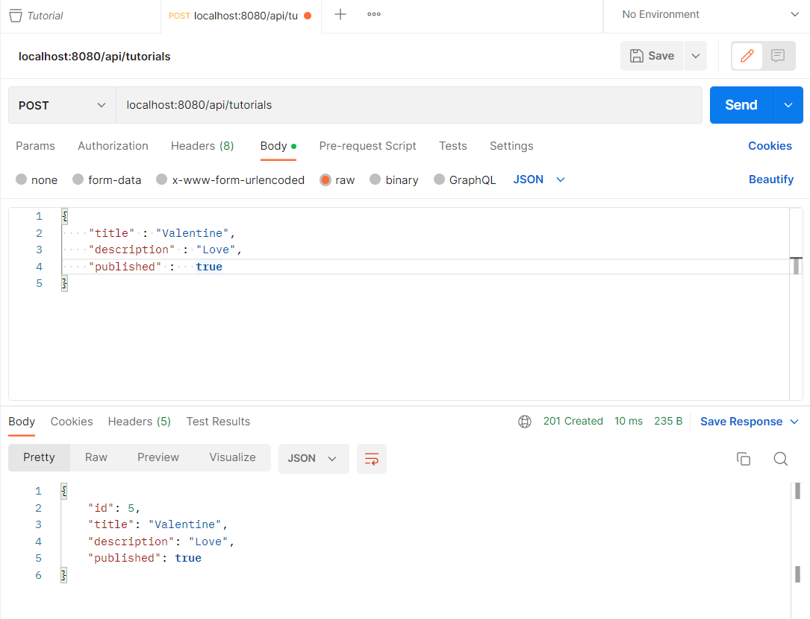
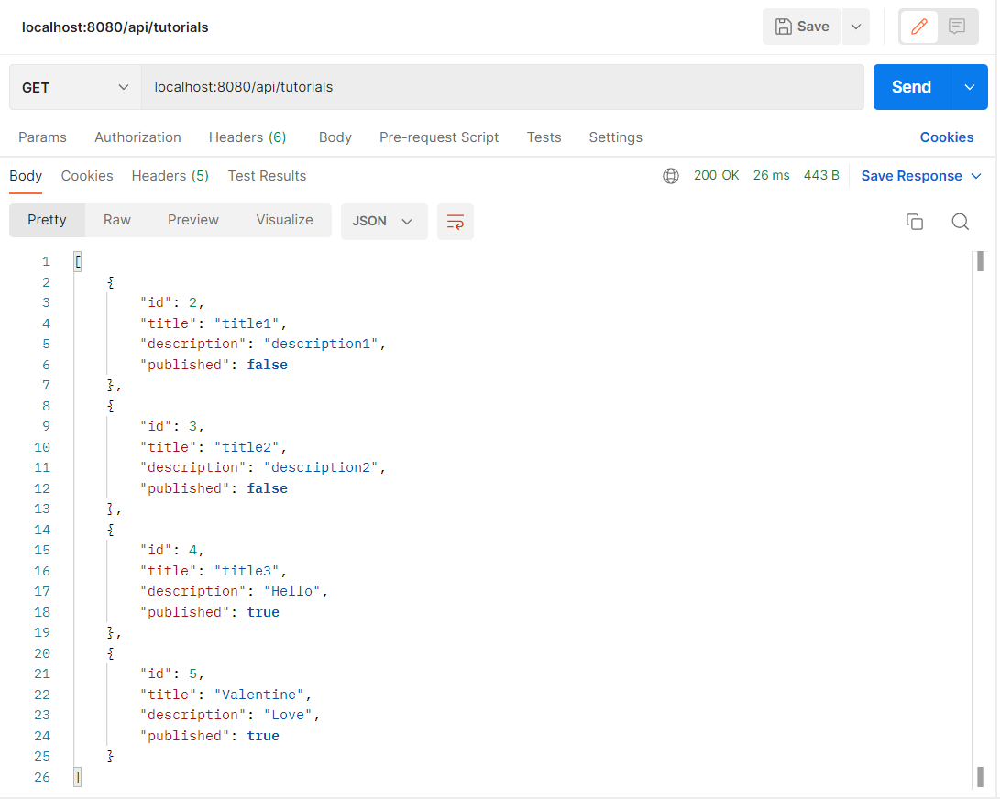
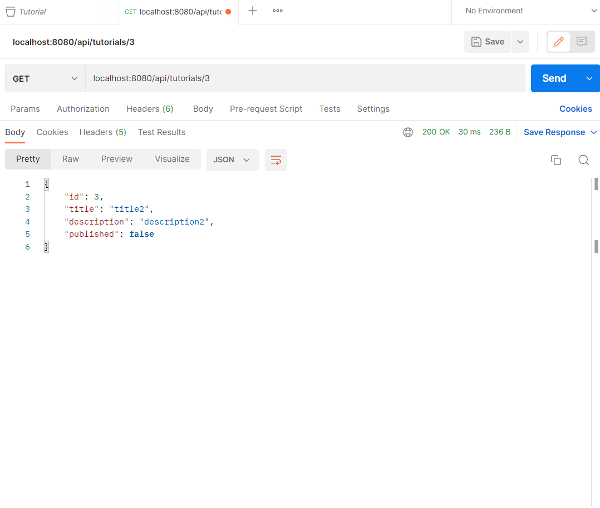
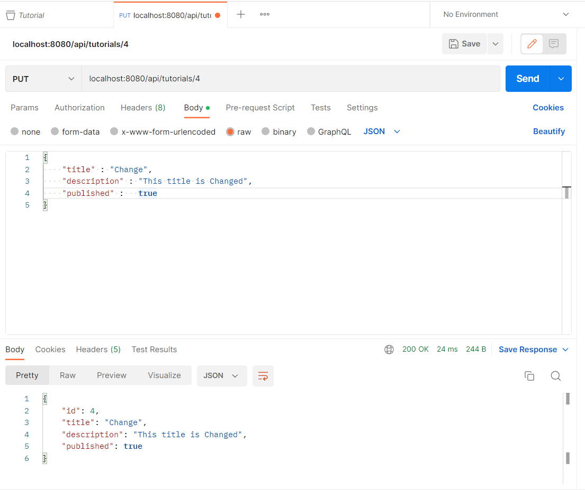
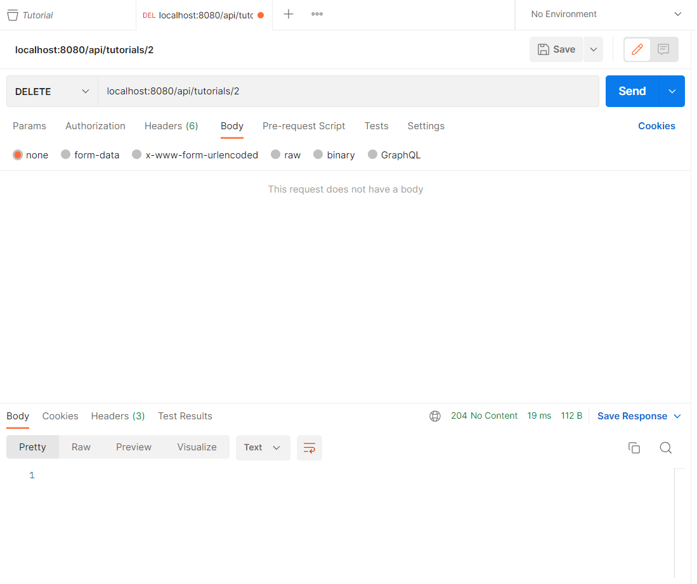
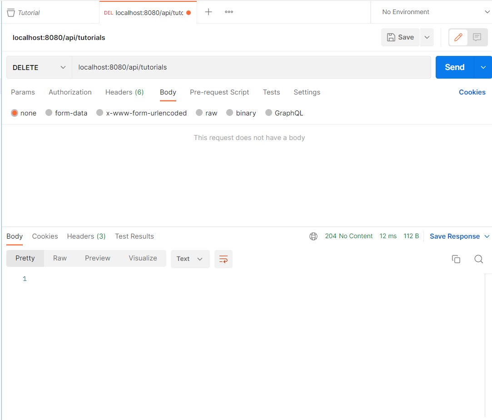
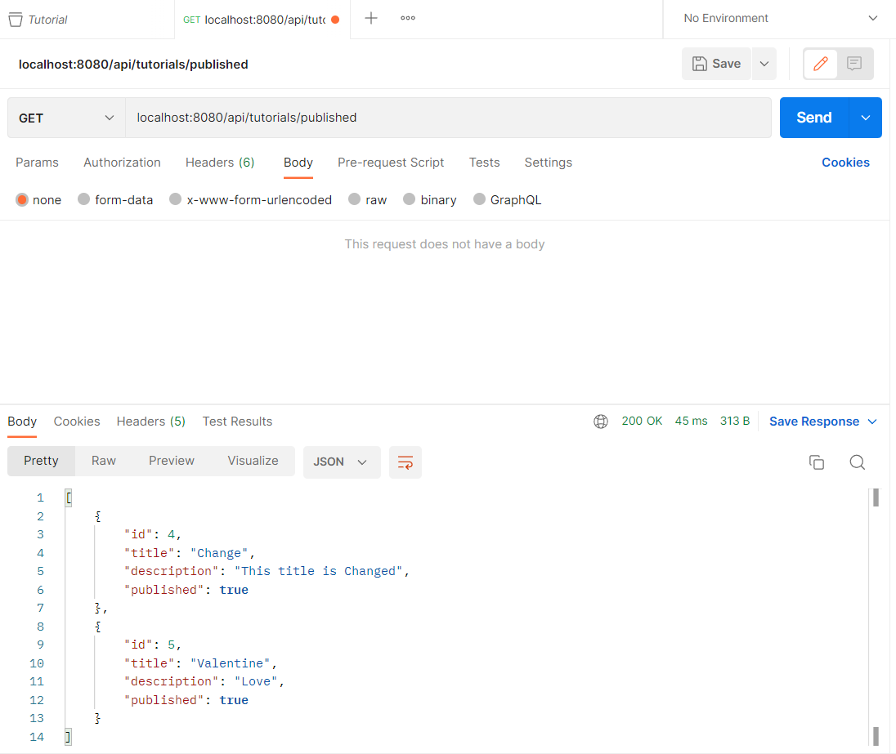
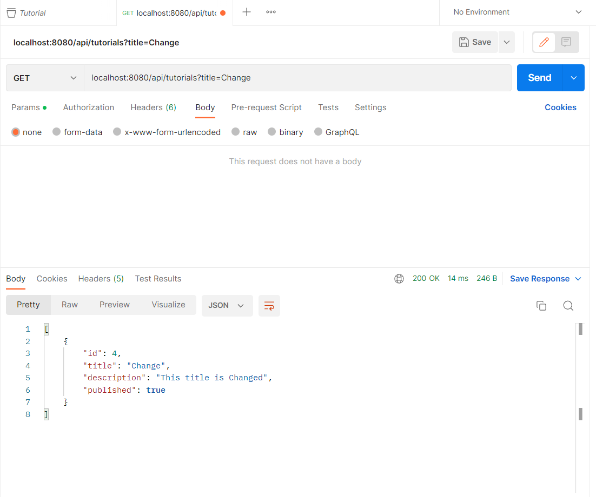

# Tutorial Project

### Creator
Duong Hoang Minh
***
### API
1. [API 1: Create a tutorial](#api-1)
2. [API 2: View All tutorial](#api-2)
3. [API 3: View tutorial by ID](#api-3)
4. [API 4: Update a tutorial](#api-4)
5. [API 5: Delete a tutorial by ID](#api-5)
6. [API 6: Delete All tutorial](#api-6)
7. [API 7: View tutorial published](#api-7)
8. [API 8: View All tutorial with title](#api-8)
***

### Content
#### API 1

***

#### API 2

***

#### API 3

***

#### API 4

***

#### API 5

***

#### API 6

***

#### API 7

***

#### API 8

